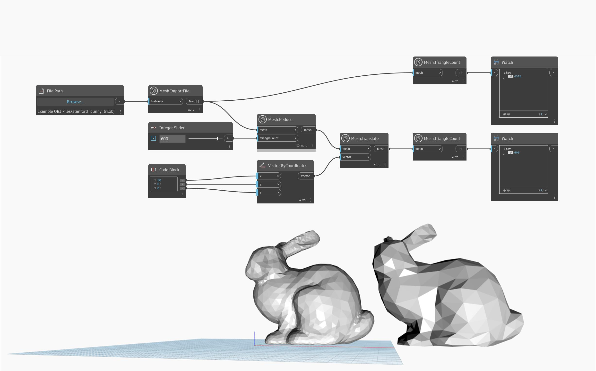

## En detalle
`Mesh.Reduce` crea una nueva malla con un número reducido de triángulos. La entrada `triangleCount` define el número objetivo de triángulos de la malla de salida. Tenga en cuenta que `Mesh.Reduce` puede modificar considerablemente la forma de la malla en caso de objetivos de `triangleCount` extremadamente agresivos. En el ejemplo siguiente, se utiliza `Mesh.ImportFile` para importar una malla, que a continuación se reduce mediante el nodo `Mesh.Reduce` y se traslada a otra posición para obtener una mejor previsualización y comparación.

## Archivo de ejemplo

