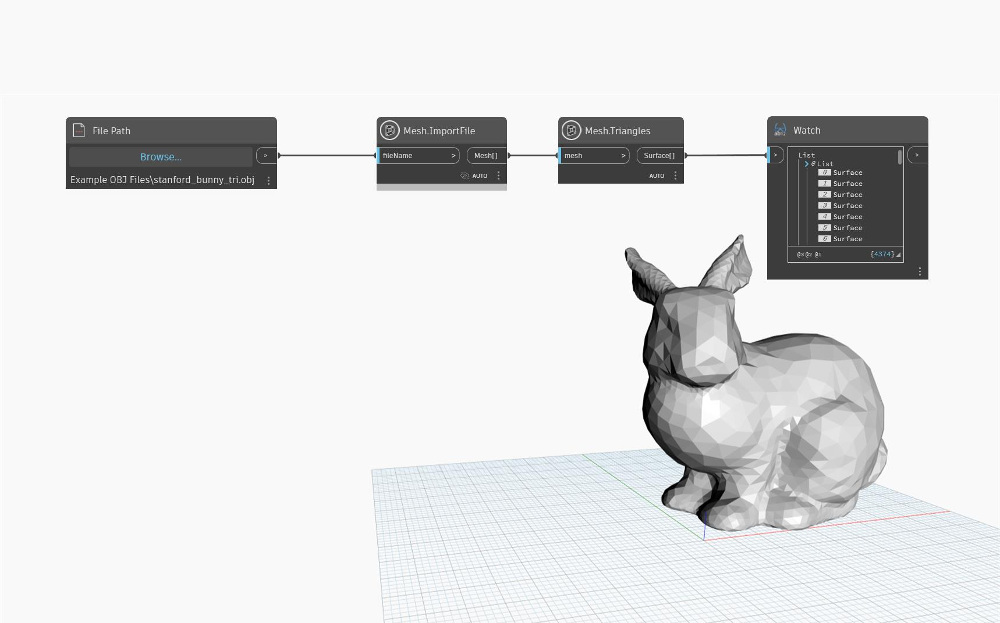

## En detalle
El método `Mesh.Triangles` devuelve las caras de la malla como una lista de superficies. Todas las superficies son triángulos. Este nodo puede utilizarse para reconstruir una malla, visualizar su estructura o convertir una malla en otras clases de geometría.

## Archivo de ejemplo

