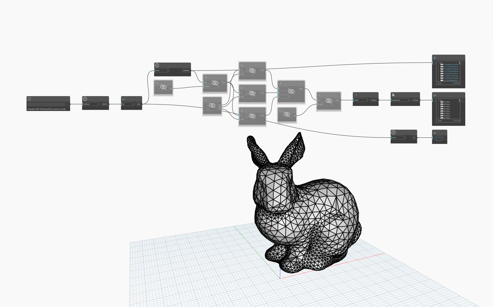

## En detalle
`Mesh.TrianglesAsNineNumbers` determina las coordenadas X, Y y Z de los vértices que componen cada triángulo de una malla proporcionada, dando como resultado nueve números por triángulo. Este nodo puede ser útil para consultar, reconstruir o convertir la malla original.

En el ejemplo siguiente, se utilizan `File Path` y `Mesh.ImportFile` para importar una malla. A continuación, se utiliza `Mesh.TrianglesAsNineNumbers` para obtener las coordenadas de los vértices de cada triángulo. A continuación, esta lista se subdivide en tres utilizando `List.Chop` con la entrada `lengths` establecida en 3. Se utiliza a continuación `List.GetItemAtIndex` para obtener cada coordenada X, Y y Z, y reconstruir los vértices mediante `Point.ByCoordinates`. La lista de puntos se divide a su vez en tres (3 puntos por cada triángulo) y se utiliza como entrada para `Polygon.ByPoints`.

## Archivo de ejemplo

