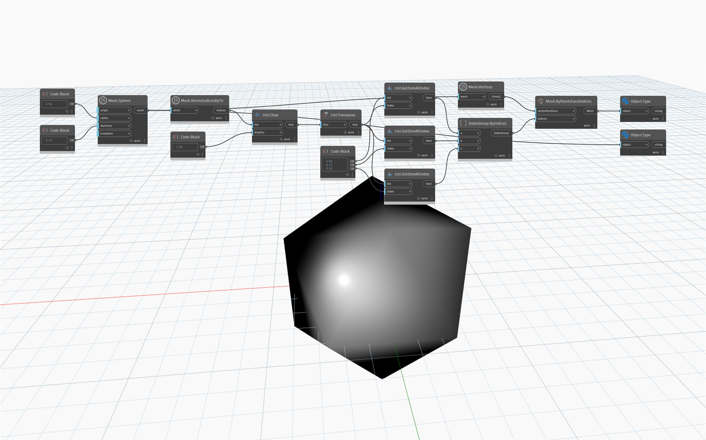

## En detalle
`Mesh.VertexIndicesByTri` devuelve una lista aplanada de índices de vértices correspondientes a cada triángulo de la malla. Los índices están ordenados de tres en tres y las agrupaciones de índices pueden reconstruirse fácilmente utilizando el nodo `List.Chop` con la entrada `lengths` de 3.

En el ejemplo siguiente, un componente `MeshToolkit.Mesh` con 20 triángulos se convierte en `Geometry.Mesh`. Se utiliza `Mesh.VertexIndicesByTri` para obtener la lista de índices que luego se divide en listas de tres mediante `List.Chop`. La estructura de la lista se invierte utilizando `List.Transpose` para obtener tres listas de nivel superior de 20 índices correspondientes a los puntos A, B y C de cada triángulo de la malla. El nodo `IndexGroup.ByIndices` se utiliza para crear grupos de índices de tres índices cada uno. La lista estructurada de `IndexGroups` y la lista de vértices se emplean a continuación como entrada para `Mesh.ByPointsFaceIndices` a fin de obtener una malla convertida.

## Archivo de ejemplo

