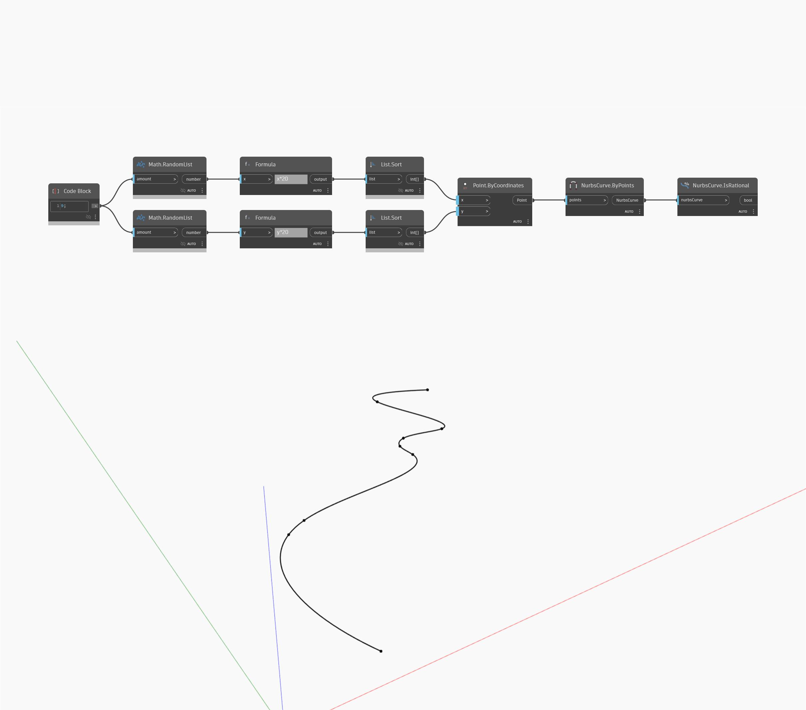

## En detalle:
IsRational devolverá un valor booleano en función de si una NurbsSurface es racional. En el siguiente ejemplo, una NurbsSurface creada mediante la aproximación de una superficie devuelve el valor "false" (falso).
___
## Archivo de ejemplo

