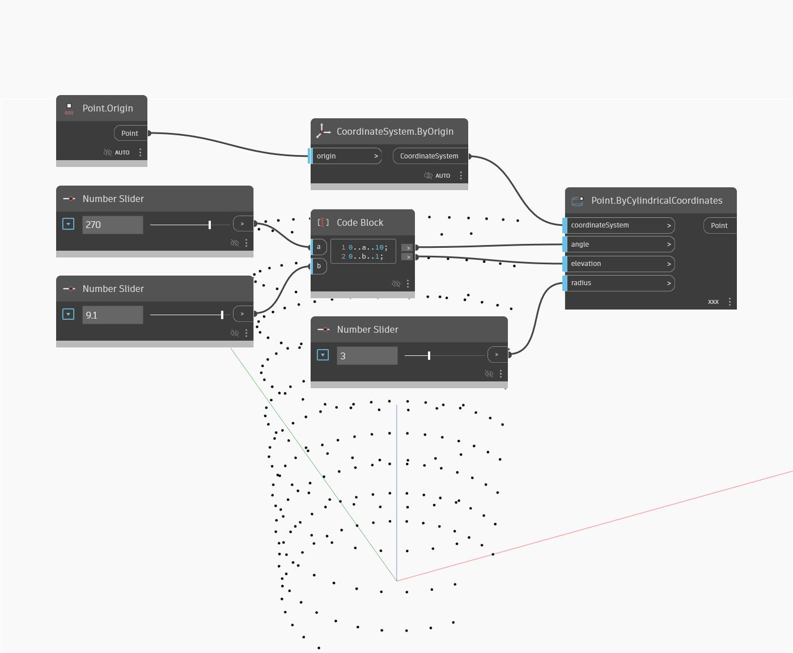

## En detalle:
El nodo ByCylindricalCoordinates crea un punto situado dentro de un espacio cilíndrico. En este ejemplo, se establece el encaje en referencia cruzada y se utiliza un rango de ángulos y elevaciones para generar una rejilla de puntos a lo largo de un cilindro con un radio dinámico.
___
## Archivo de ejemplo

