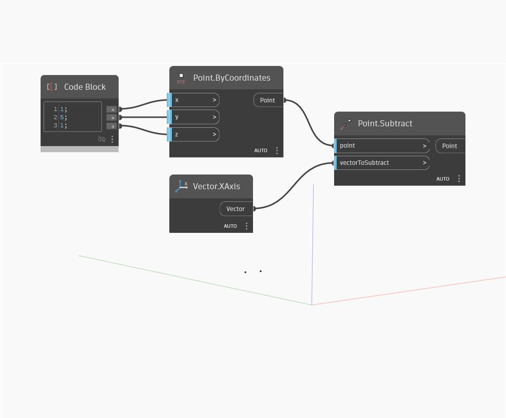

## En detalle:
`Point.Subtract` resta los componentes X, Y y Z de un vector de entrada de las coordenadas correspondientes del punto de entrada. Es igual a trasladar el punto por la inversa del vector especificado.

En el ejemplo siguiente, creamos un punto mediante un bloque de código para especificar las coordenadas X, Y y Z; a continuación, añadimos un vector XAxis universal como `vectorToSubtract`. El resultado es el punto trasladado una distancia de 1 en la dirección X negativa.

___
## Archivo de ejemplo

