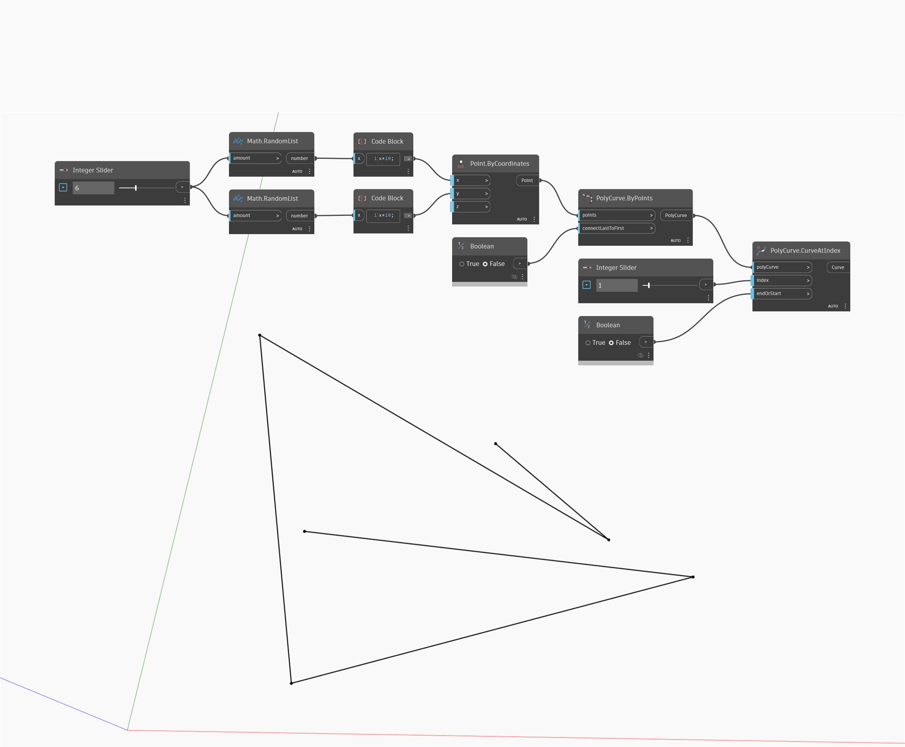

## En detalle:
CurveAtIndex devolverá el segmento de curva en el índice de entrada de una PolyCurve especificada. Si el número de curvas de la PolyCurve es menor que el índice especificado, CurveAtIndex devolverá "null" (nulo). La entrada endOrStart acepta un valor booleano "true" (verdadero) o "false" (falso). Si es "true" (verdadero), CurveAtIndex comenzará a contar en el primer segmento de la PolyCurve. Si es "false" (falso), contará hacia atrás desde el último segmento. En el siguiente ejemplo, se genera un conjunto de puntos aleatorios y, a continuación, se utiliza PolyCurve.ByPoints para crear una PolyCurve abierta. A continuación, se puede utilizar CurveAtIndex para extraer segmentos específicos de la PolyCurve.
___
## Archivo de ejemplo

