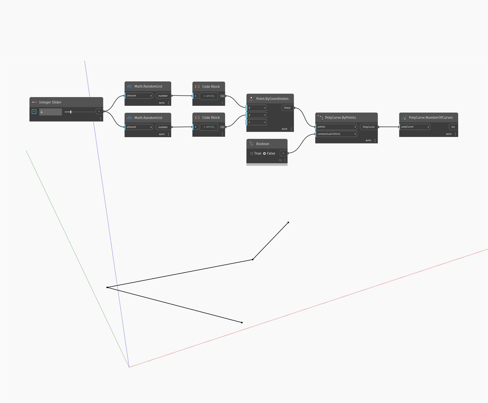

## En detalle:
NumberOfCurves devuelve el número de segmentos de curva que componen una PolyCurve especificada. En el siguiente ejemplo, se genera un conjunto de puntos aleatorios y se utiliza Polygon.ByPoints para crear una PolyCurve. Si connectLastToFirst se deja como "false" (falso), el número de curvas será uno menos que el número de puntos. De lo contrario, si se crea una PolyCurve cerrada, el número de curvas será igual al número de puntos iniciales.
___
## Archivo de ejemplo

