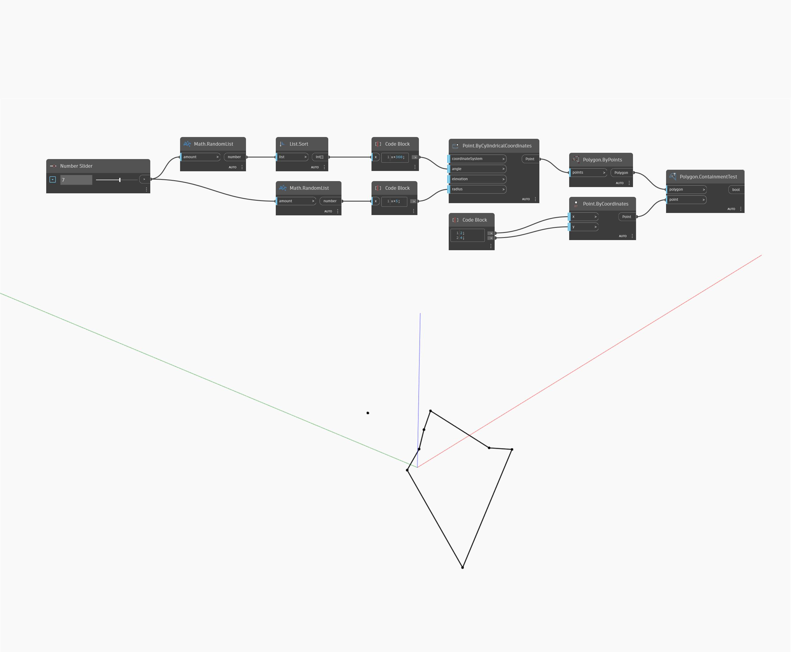

## En detalle:
ContainmentTest devuelve un valor booleano en función de si un punto determinado se incluye dentro de un polígono especificado. Para que funcione, el polígono debe ser plano y no intersecarse consigo mismo. En el siguiente ejemplo, se crea un polígono mediante una serie de puntos generados por coordenadas cilíndricas. Si se mantiene constante la elevación y se ordenan los ángulos, se garantiza que el polígono sea plano y no se interseque consigo mismo. A continuación, se crea un punto de prueba y se utiliza ContainmentTest para ver si el punto está dentro o fuera del polígono.
___
## Archivo de ejemplo

