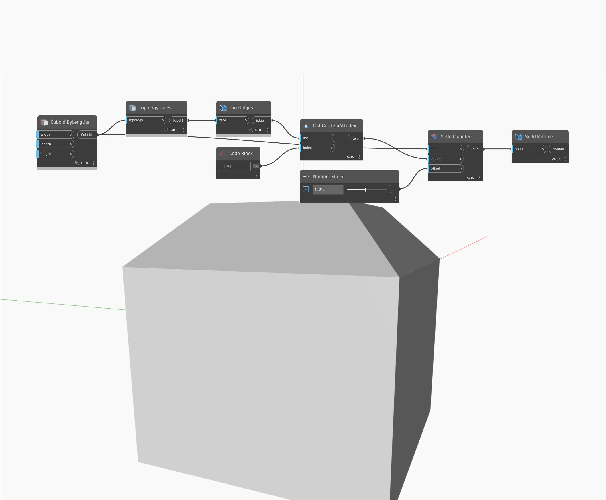

## En detalle:
Volume devolverá el volumen de un sólido especificado. En el siguiente ejemplo, se comienza con un cubo y, a continuación, se achaflanan los bordes para generar un nuevo sólido. Volume se puede utilizar para buscar el nuevo volumen de este sólido.
___
## Archivo de ejemplo

