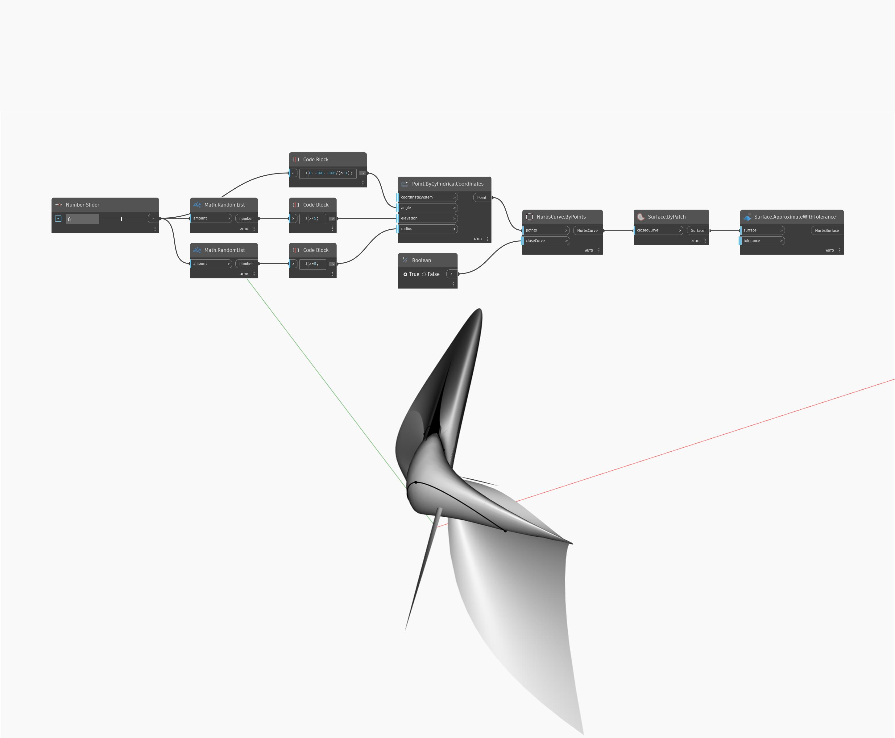

## En detalle:
ApproximateWithTolerance creará una NurbsSurface que se aproxime a una superficie de entrada. La entrada de tolerancia determina la precisión con la que el resultado coincidirá con la superficie original. En el siguiente ejemplo, se crea una superficie mediante un nodo ByPatch con una curva NURBS cerrada como entrada. Tenga en cuenta que, cuando se usa esta superficie como entrada para un nodo ApproximateWithTolerance, el resultado es una NurbsSurface sin recortar con cuatro lados.
___
## Archivo de ejemplo

