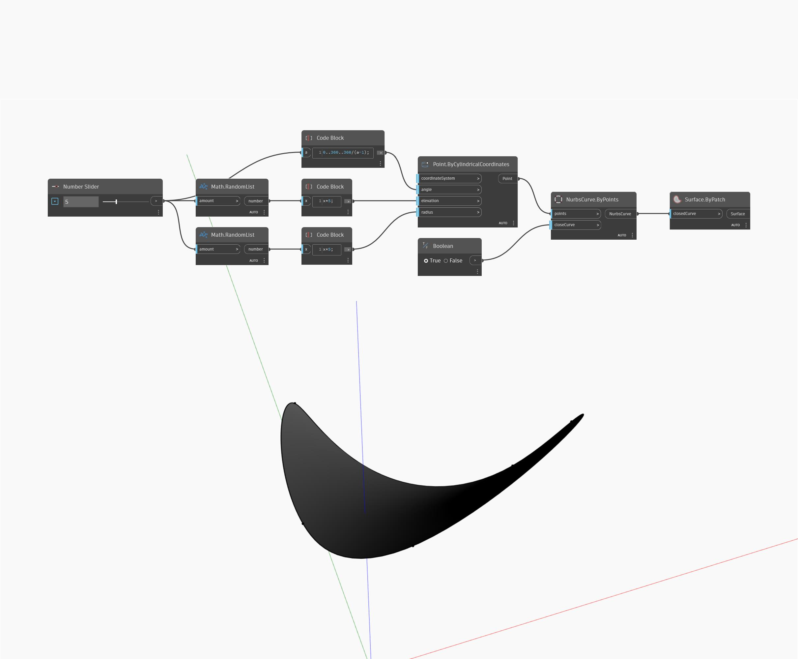

## En detalle:
Surface.ByPatch creará una superficie rellenando el interior de una curva cerrada. En el siguiente ejemplo, se crea primero una curva NURBS cerrada mediante una serie de puntos creados con coordenadas cilíndricas. Un control deslizante de número ajusta el número de puntos que se van a crear, mientras que un nodo de conmutador booleano controla si la curva NURBS está cerrada o no. Se utiliza la curva NURBS como entrada para un nodo Surface.ByPatch, lo que crea una superficie en el interior de la curva cerrada.
___
## Archivo de ejemplo

