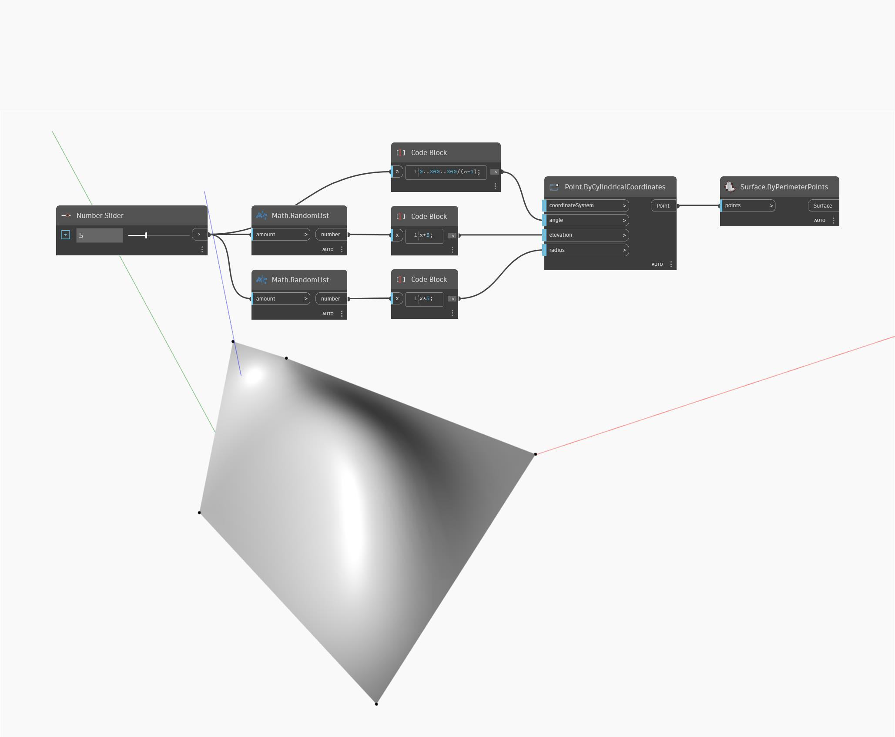

## En detalle:
Surface.ByPerimeterPoints utiliza una lista de puntos que define el perímetro de un polígono cerrado y crea una superficie dentro del polígono resultante. En el siguiente ejemplo, se crea una serie de puntos mediante coordenadas cilíndricas. Los puntos se crean a intervalos regulares alrededor de un cilindro con entradas aleatorias para el radio y la elevación. La lista resultante de puntos se utiliza como entrada para un nodo Surface.ByPerimeterPoints.
___
## Archivo de ejemplo

