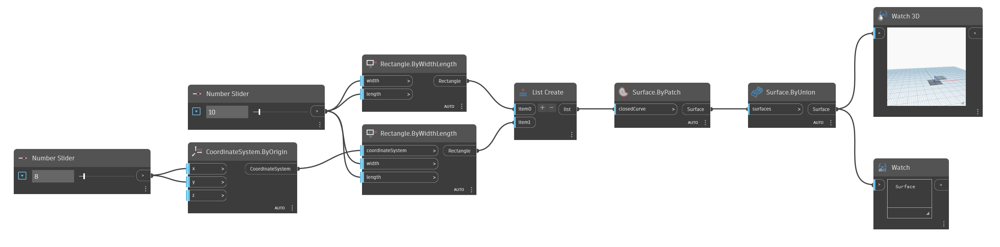

## En detalle:
Surface.ByUnion unirá todas las superficies de entrada. Devolverá una PolySurface si las superficies de entrada dan como resultado una superficie de varias caras.
___
## Archivo de ejemplo

