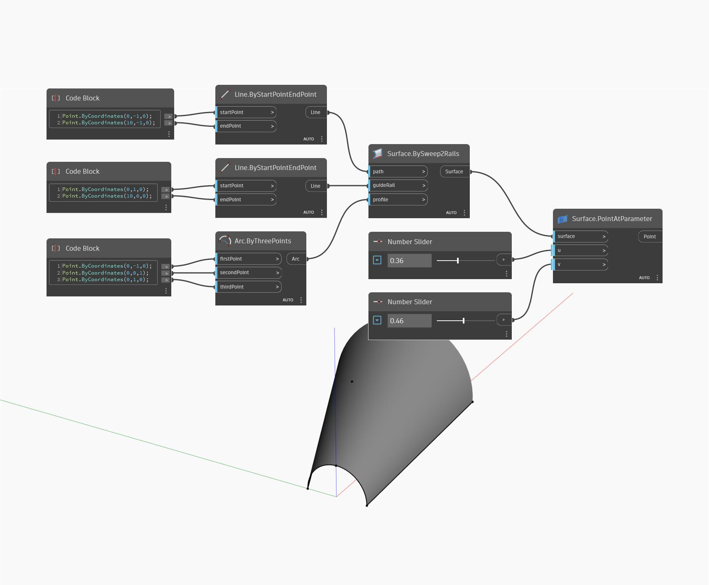

## En detalle:
PointAtParameter devolverá el punto en una superficie especificada por los parámetros U y V. En el siguiente ejemplo, se crea una superficie mediante un nodo BySweep2Rails. A continuación, se utilizan dos controles deslizantes de número para ajustar los valores U y V del parámetro para un nodo PointAtParameter.
___
## Archivo de ejemplo

