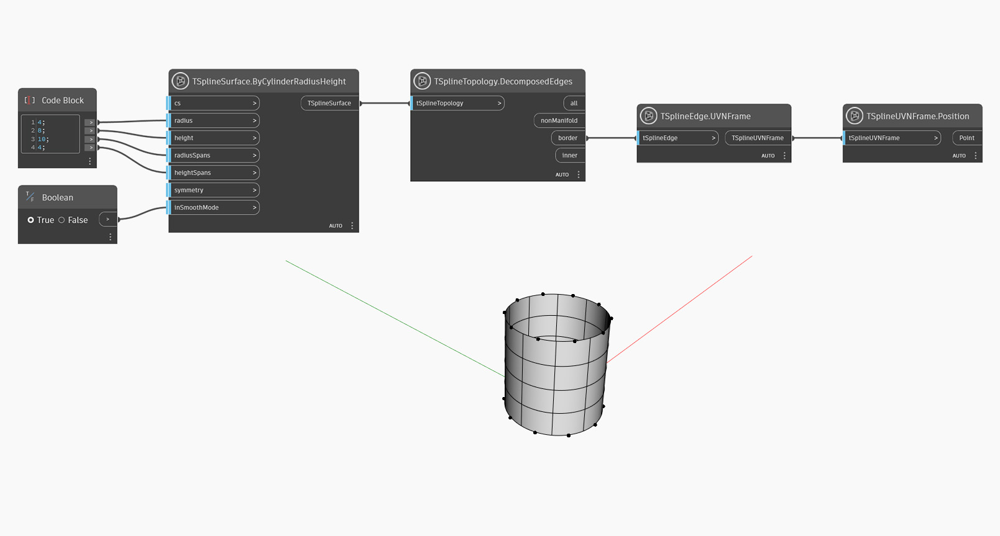

## In-Depth
En el ejemplo siguiente, se utilizan los nodos `TSplineEdge.UVNFrame` y `TSplineUVNFrame.Position` para obtener una vista preliminar de la posición de las aristas de borde de una superficie de T-Spline.

## Archivo de ejemplo

