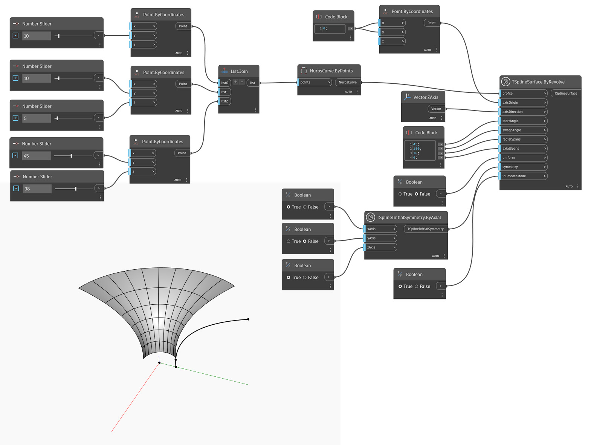

## En detalle:
En el ejemplo siguiente, se crea una superficie de T-Spline mediante la revolución de una curva de perfil, definida por `profile` en torno al valor de `axisOrigin` especificado en `axisDirection`. La extensión de la revolución se controla mediante `startAngle` y `sweepAngle`. La definición se establece mediante `radialSpans` y `axialSpans`. La entrada `uniform`controla si los tramos a lo largo del perfil se distribuyen uniformemente o teniendo en cuenta la curvatura. La simetría inicial de la forma se especifica mediante la entrada `symmetry`. Por último, la entrada `inSmoothMode` se utiliza para alternar entre la vista preliminar en modo de cuadro y suavizado de la superficie de T-Spline.

## Archivo de ejemplo

