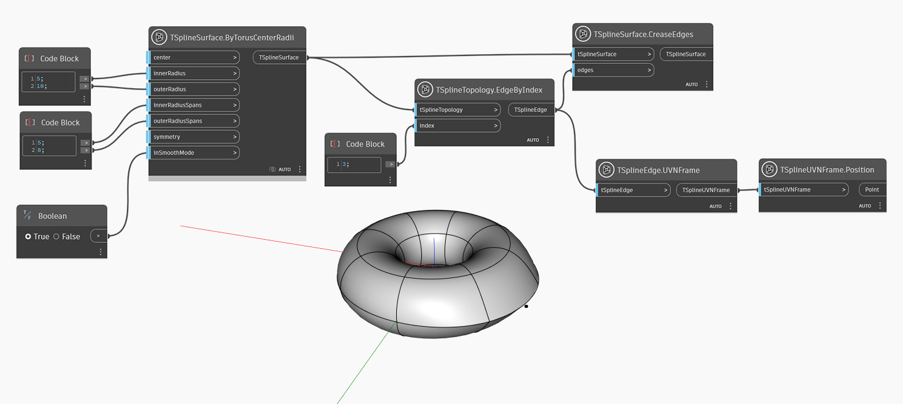

## In-Depth
`TSplineSurface.CreaseEdges` añade un pliegue pronunciado al borde especificado en una superficie de T-Spline.
En el ejemplo siguiente, se genera una superficie de T-Spline a partir de un toroide de T-Spline. Se selecciona una arista mediante el nodo `TSplineTopology.EdgeByIndex` y se aplica un pliegue a esa arista con la ayuda del nodo `TSplineSurface.CreaseEdges`. También se pliegan los vértices de ambas aristas de la arista. La posición de la arista seleccionada se previsualiza con ayuda de los nodos `TSplineEdge.UVNFrame` y `TSplineUVNFrame.Poision`.

## Archivo de ejemplo

