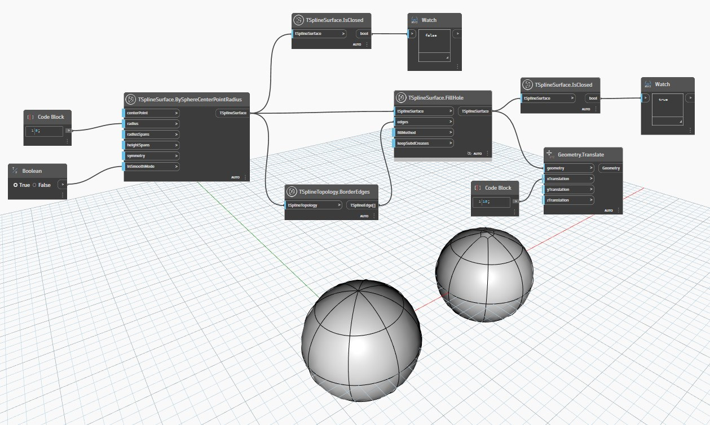

## En detalle:
Una superficie cerrada es aquella que presenta una forma completa sin huecos ni contornos.
En el ejemplo siguiente, se inspecciona una esfera de T-Spline generada mediante `TSplineSurface.BySphereCenterPointRadius` con `TSplineSurface.IsClosed` para comprobar si está abierta, lo que devuelve un resultado negativo. Esto se debe a que las esferas de T-Spline, aunque aparecen cerradas, están realmente abiertas en los polos en los que se apilan varias aristas y vértices en un punto.

A continuación, se rellenan los huecos de la esfera de T-Spline mediante el nodo `TSplineSurface.FillHole`, lo que genera una ligera deformación en el lugar donde se rellenó la superficie. Cuando se comprueba de nuevo mediante el nodo `TSplineSurface.IsClosed`, ahora se obtiene un resultado positivo, lo que significa que está cerrada.
___
## Archivo de ejemplo

