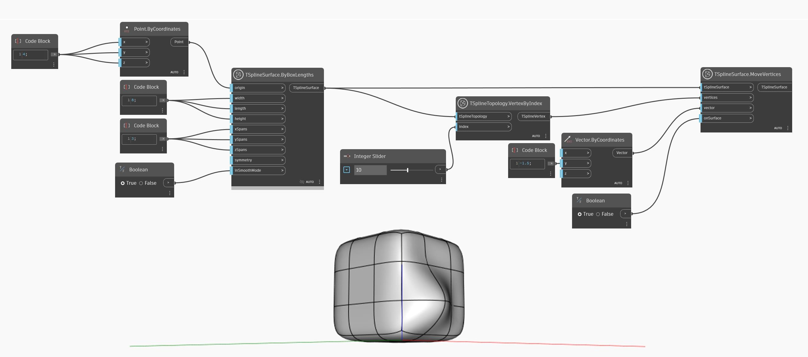

## En detalle:
En el ejemplo siguiente, se recopila un vértice de una superficie de T-Spline mediante el nodo `TSplineTopology.VertexByIndex`. A continuación, el vértice se utiliza como entrada para el nodo `TSplineSurface.MoveVertices`. El vértice se desplaza en una dirección especificada por la entrada `vector`. La entrada `onSurface` tiene en cuenta la superficie en el desplazamiento cuando se establece en el valor `True`(verdadero) o el movimiento de los puntos de control cuando se establece en el valor `False` (falso).
___
## Archivo de ejemplo

