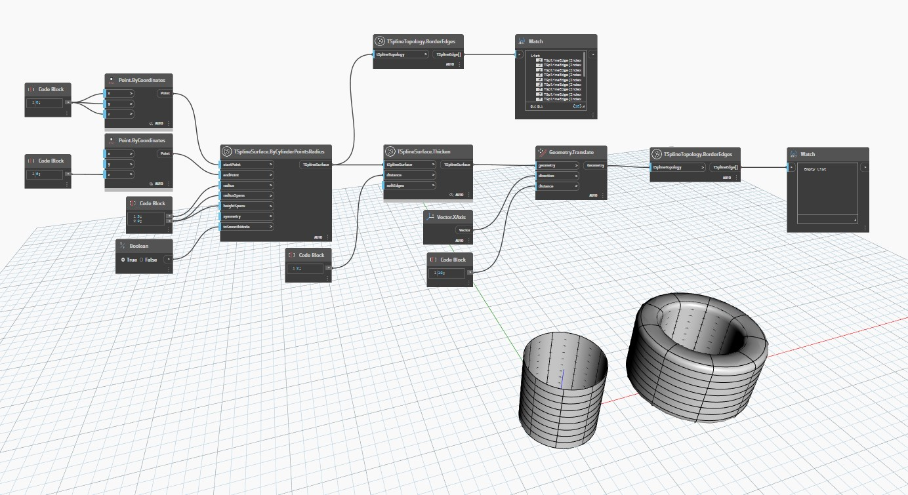

## En detalle:
`TSplineTopology.BorderEdges` devuelve una lista de aristas de borde incluidas en la superficie de T-Spline.

En el ejemplo siguiente, se crean dos superficies de T-Spline mediante `TSplineSurface.ByCylinderPointsRadius`; una es una superficie abierta, mientras que la otra se engrosa mediante `TSplineSurface.Thicken`, lo que la convierte en una superficie cerrada. Cuando se examinan ambas con el nodo `TSplineTopology.BorderEdges`, la primera devuelve una lista de aristas de borde mientras que la segunda devuelve una lista vacía. Esto se debe a que, como se trata de una superficie cerrada, no hay aristas de borde.
___
## Archivo de ejemplo

