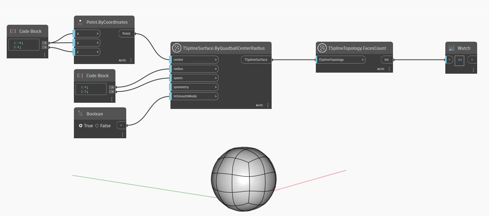

## En detalle:
En el ejemplo siguiente, el nodo `TSplineTopology.FacesCount` se utiliza para devolver el número de caras de una superficie de T-Spline de esfera de malla cuadrada.
___
## Archivo de ejemplo

