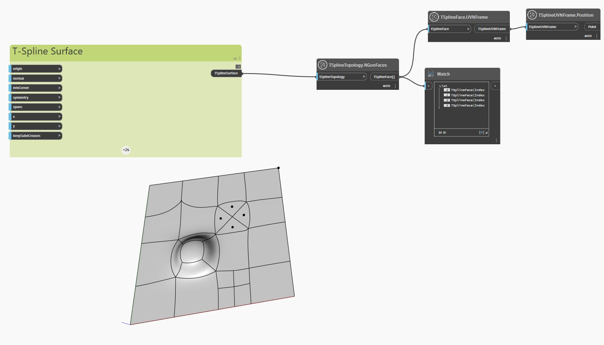

## En detalle:
En el ejemplo siguiente, se inspecciona una superficie de T-Spline plana con caras y vértices extruidos, subdivididos y estirados con el nodo `TSplineTopology.NGonFaces`.

Los nodos `TSplineFace.UVNFrame` y `TSplineUVNFrame.Position` se utilizan para resaltar el centro de las caras de Ngon de la superficie.
___
## Archivo de ejemplo

