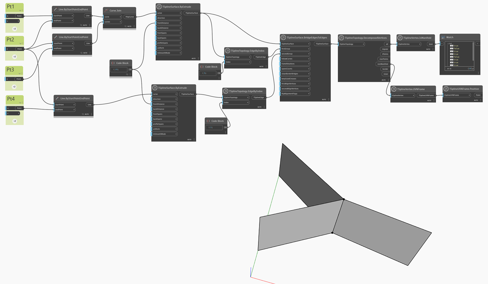

## In-Depth
En el ejemplo siguiente, se genera una superficie no múltiple mediante la unión de dos superficies que comparten una arista interna. El resultado es una superficie que no tiene un anverso y un reverso claros. La superficie no múltiple solo se puede mostrar en modo de cuadro hasta que se repare. Se utiliza `TSplineTopology.DecomposedVertices` para consultar todos los vértices de la superficie y se utiliza el nodo `TSplineVertex.IsManifold` para resaltar los vértices que se consideran múltiples. Los vértices no múltiples se extraen y su posición se visualiza mediante los nodos `TSplineVertex.UVNFrame` y `TSplineUVNFrame.Position`.

## Archivo de ejemplo

