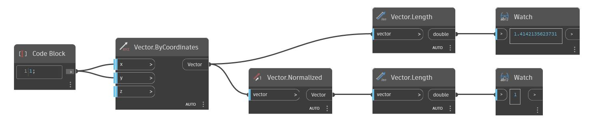

## En detalle:
Normalized devolverá un vector normalizado. El vector devuelto tendrá una longitud de 1, independientemente de su longitud original. En el siguiente ejemplo, un vector de longitud ~1.4142 se normaliza a una longitud de 1.
___
## Archivo de ejemplo

