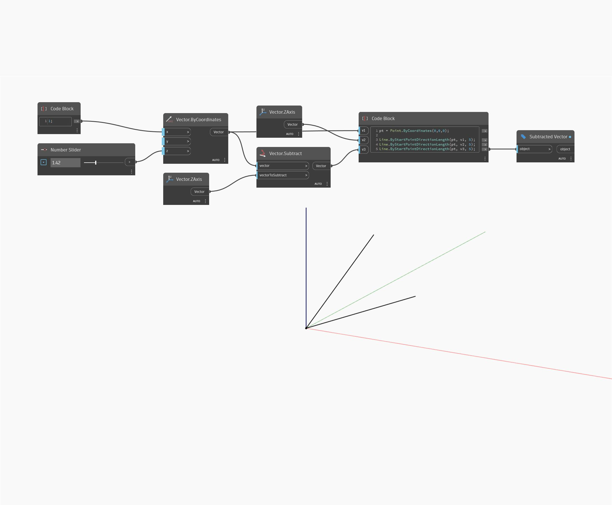

## En detalle:
Subtract devolverá un vector que es la diferencia de otros dos vectores. En el siguiente ejemplo, la diferencia de un vector con coordenadas (1,0,1) y del eje Z del SCU da como resultado un vector con coordenadas de (1,0,0). Al ajustar el control deslizante de dirección del vector, se cambiarán los valores de coordenadas del vector y se devolverá un vector sustraído diferente. Los vectores se representan como líneas.
___
## Archivo de ejemplo

