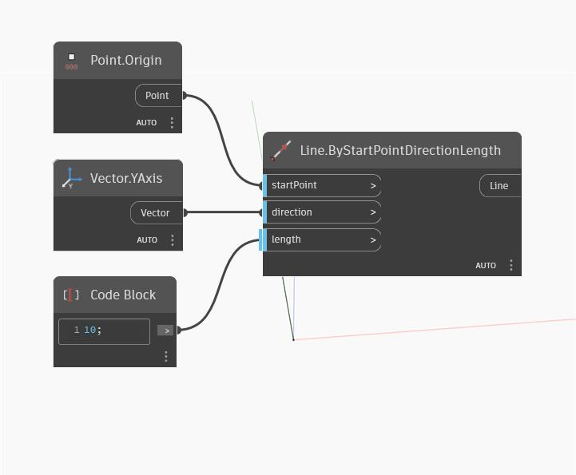

## En detalle:
YAxis devolverá un vector que representa el eje Y del WorldCoordinateSystem. En el siguiente ejemplo, el vector devuelto se utiliza para crear una línea que sigue el eje Y del SCU.
___
## Archivo de ejemplo

