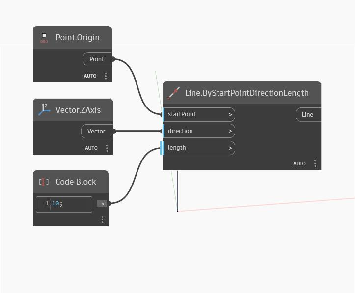

## En detalle:
ZAxis devolverá un vector que representa el eje Z del WorldCoordinateSystem. En el siguiente ejemplo, el vector devuelto se utiliza para crear una línea que sigue el eje Z del SCU.
___
## Archivo de ejemplo

