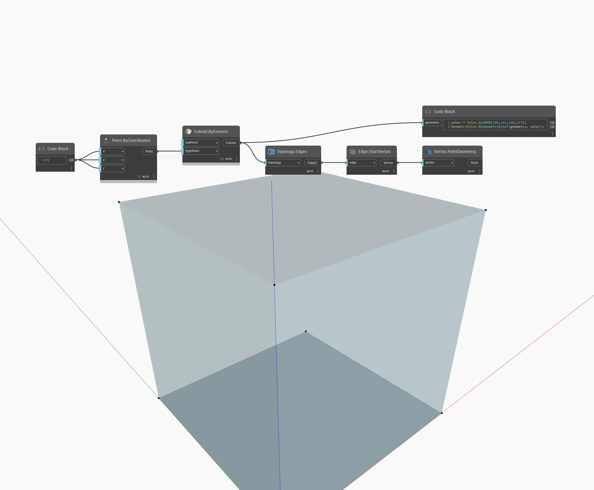

## En detalle:
PointGeometry devolverá las ubicaciones de vértice como puntos. En el siguiente ejemplo, los vértices de un cubo se devuelven y se representan como puntos.
___
## Archivo de ejemplo

