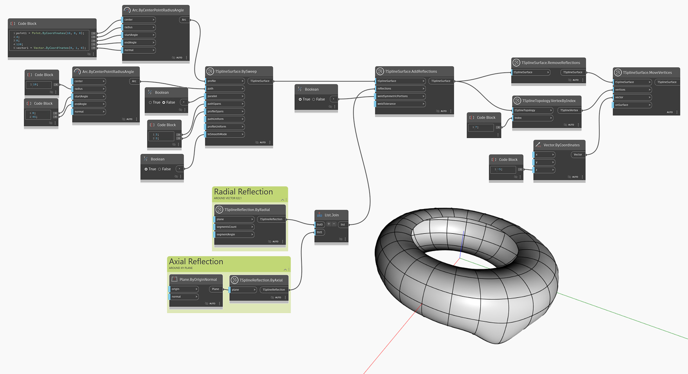

<!--- Autodesk.DesignScript.Geometry.TSpline.TSplineSurface.RemoveReflections --->
<!--- B6UBJT6X5TJMS4P6CSS7JRJI6HDOCJMIND4VHXATYF2L5IPVPQBQ --->
## In-Depth
`TSplineSurface.RemoveReflections` elimina las reflexiones de la entrada`tSplineSurface`. Al eliminar las reflexiones no se modifica la forma, pero se interrumpe la dependencia entre las partes reflejadas de la geometría, lo que le permite editarlas de forma independiente.

En el ejemplo siguiente, se crea primero una superficie de T-Spline mediante la aplicación de reflexiones axiales y radiales. A continuación, la superficie se transfiere al nodo `TSplineSurface.RemoveReflections`, lo que elimina las reflexiones. Para mostrar cómo afecta esto a las modificaciones posteriores, uno de los vértices se desplaza mediante un nodo `TSplineSurface.MoveVertex`. Debido a que se eliminan las reflexiones de la superficie, solo se modifica un vértice.

## Archivo de ejemplo

