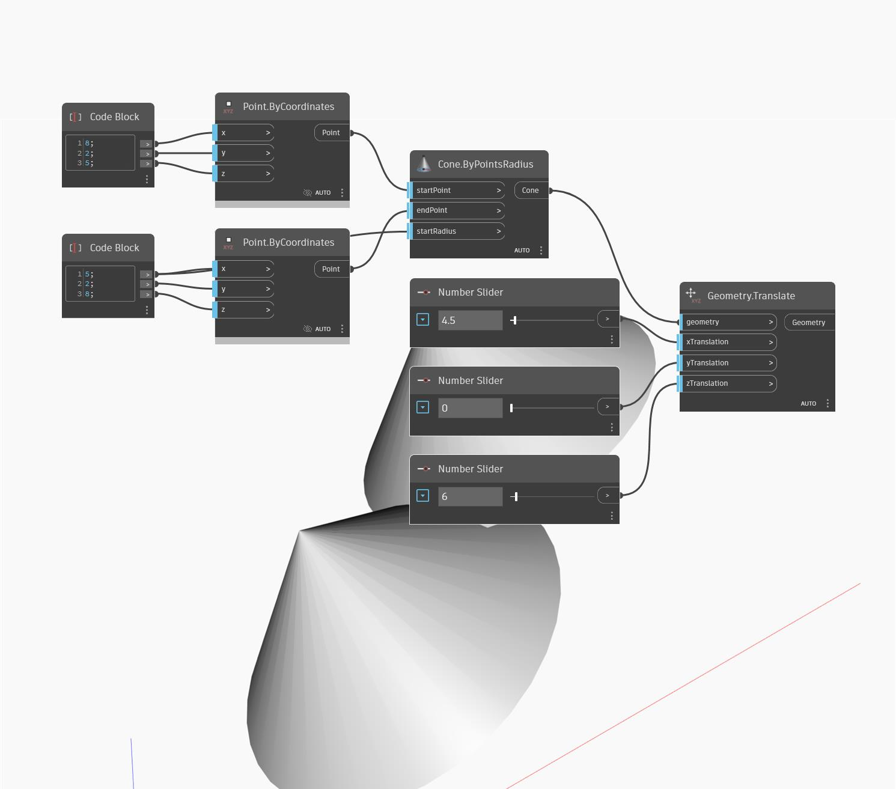

<!--- Autodesk.DesignScript.Geometry.Geometry.Translate(xTranslation, yTranslation, zTranslation) --->
<!--- CAQVXZBP5BJQVX7OKQYBMFD4SIBKAOGY3GDMXALYEEBP4UKHEUMQ --->
## En detalle:
Traslada cualquier geometría especificada conforme a los desplazamientos en las direcciones X, Y y Z definidos en el SCU.
___
## Archivo de ejemplo

