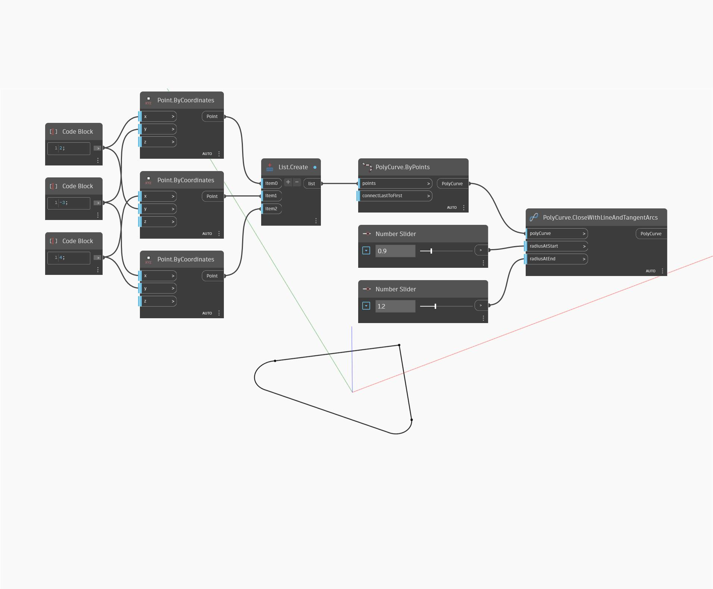

<!--- Autodesk.DesignScript.Geometry.PolyCurve.CloseWithLineAndTangentArcs --->
<!--- CT4U4755MIGFNI35WRSJ3HCWSD6YXTW5YXJUSHYG656EL5ROU3MQ --->
## En detalle:
CloseWithLineAndTangentArcs devolverá una línea y arcos tangentes para cerrar una PolyCurve abierta. En el siguiente ejemplo, una PolyCurve con dos segmentos se cierra con una línea y arcos. Los arcos se definen en función de si se encuentran al inicio o al final de la nueva línea y sus radios se pueden controlar de forma independiente.
___
## Archivo de ejemplo

