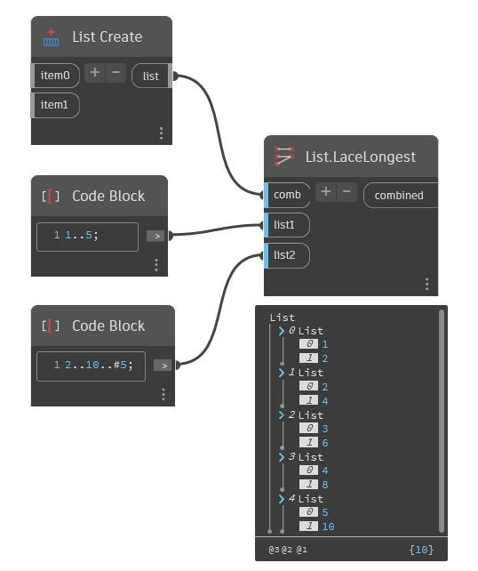

## En detalle:
Aplica un combinador a cada par resultante del encaje más largo de las listas de entrada. Todas las listas tienen repetido su último elemento para que coincida con la longitud de la entrada más larga
___
## Archivo de ejemplo

