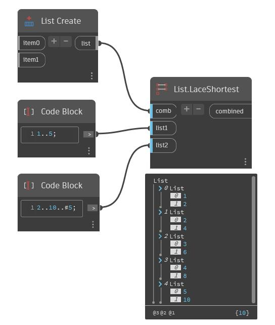

## En detalle:
Aplica un combinador a cada par resultante del encaje más corto de las listas de entrada. Todas las listas se truncan conforme a la longitud de la entrada más corta
___
## Archivo de ejemplo

