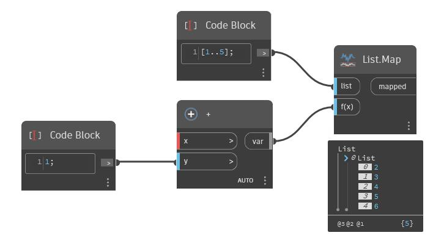

## En detalle:
Map devolverá la posición de un número en un rango como un valor doble. En el siguiente ejemplo, se asigna el valor 4 a un rango de 2 a 6. Como 4 está a medio camino entre 2 y 6, se devuelve un valor de 0.5.
___
## Archivo de ejemplo

