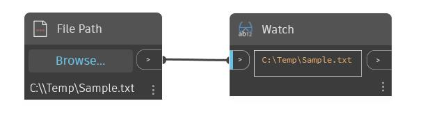

## En detalle:
FilePath permite al usuario seleccionar un archivo del ordenador. Para establecer la ruta de archivo, haga clic en el botón Examinar en el nodo FilePath y, a continuación, desplácese hasta el archivo deseado.
___
## Archivo de ejemplo

