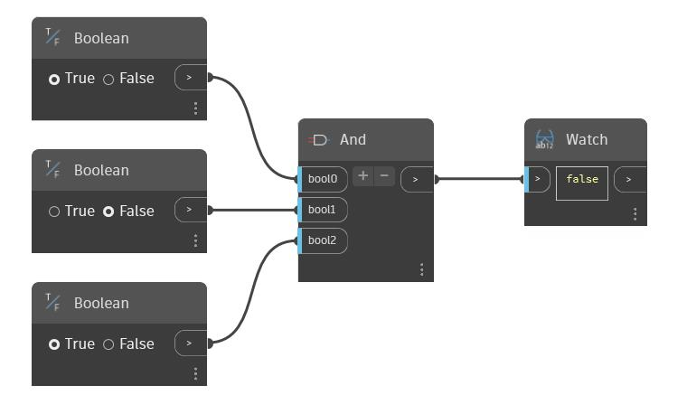

## En detalle:
And utilizará un número variable de entradas booleanas. Puede aumentar o reducir el número de entradas mediante los botones "+" y"'-" del nodo And. Cada entrada debe ser un valor booleano único. And devolverá "true" si todas las entradas son verdaderas; de lo contrario, devolverá "false" (falso). En el siguiente ejemplo, hay tres conmutadores booleanos como entradas de un nodo And. Cuando los tres valores se hayan establecido en "true" (verdadero), And devolverá "true".
___
## Archivo de ejemplo

