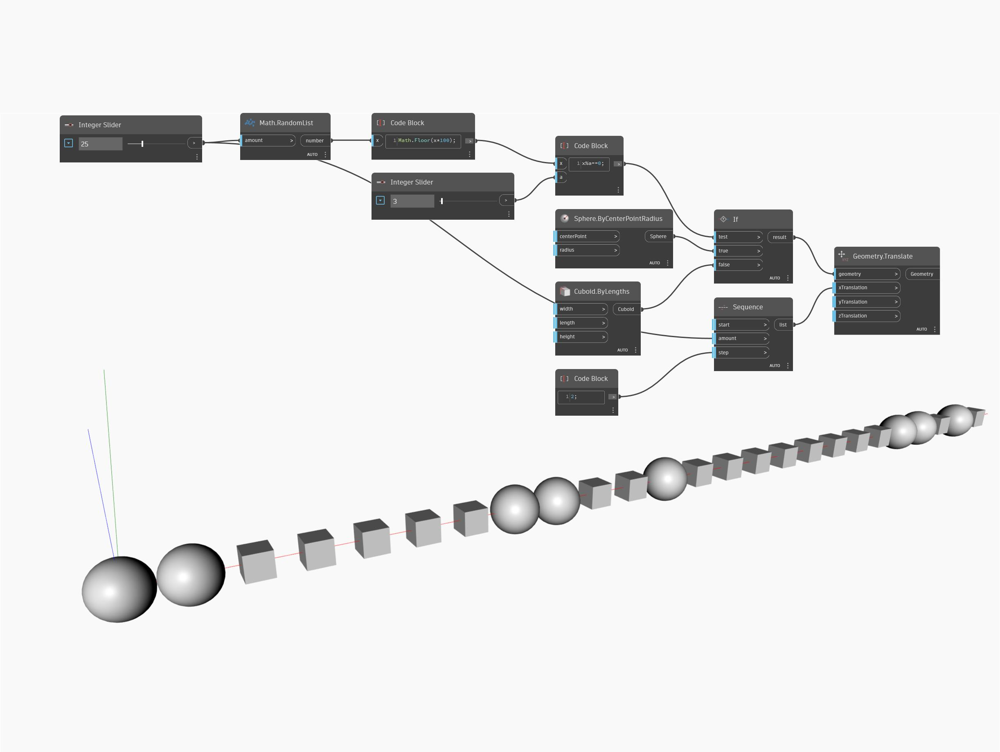

## En detalle:
If actúa como nodo de control condicional. La entrada test adopta un valor booleano, mientras que las entradas true y false pueden aceptar cualquier tipo de datos. Si el valor de true es "true" (verdadero), el nodo devolverá el elemento de la entrada true, si el valor de test es "false" (falso), el nodo devolverá el elemento de la entrada false. En el siguiente ejemplo, se genera primero una lista de números aleatorios entre 0 y 99. El número de elementos de la lista se ajusta mediante un control deslizante de entero. Se usa un bloque de código con la fórmula "x%a==0" para comprobar la divisibilidad por un segundo número, determinado por un segundo control deslizante de número. Esto genera una lista de valores booleanos correspondientes a si los elementos de la lista aleatoria son divisibles por el número determinado por el segundo control deslizante de entero. Esta lista de valores booleanos se utiliza como entrada test para un nodo If. Se utiliza una esfera por defecto como entrada true y un ortoedro por defecto como entrada false. El resultado del nodo If es una lista de esferas u ortoedros. Por último, se utiliza un nodo Translate para separar la lista de geometrías.

If se replica en todos los nodos como si se estableciese en SHORTEST (Más corto). Puede ver el motivo de esto en los ejemplos mostrados, sobre todo, cuando se observa cuál es el resultado si se aplica LONGEST (Más largo) a un nodo de fórmula y se transfiere la ramificación "corta" del elemento condicional. Estos cambios también se han realizado para permitir un comportamiento predecible al utilizar entradas booleanas únicas o una lista de valores booleanos.
___
## Archivo de ejemplo

