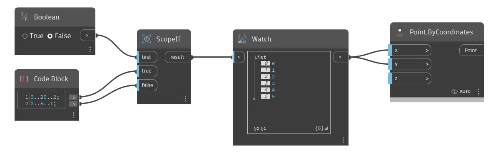

## En detalle:
ScopeIf devolverá la entrada "true" (verdadero) o "false" (falso) en función del valor booleano que se active o se desactive en la entrada de prueba. En el archivo de ejemplo siguiente, se conecta una lista grande y pequeña de números a las entradas "true" (verdadero) y "false" (falso). Al enviar el resultado de ScopeIfThrough de un nodo de creación de puntos, podemos alternar entre dos tamaños diferentes de rejillas de puntos.
___
## Archivo de ejemplo

