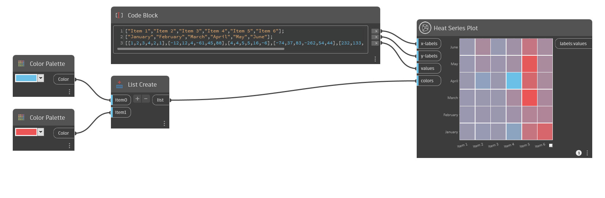

## En detalle

La opción de gráfico de serie de calor crea un gráfico en el que los puntos de datos se representan como rectángulos con colores diferentes de una gama.

Asigne etiquetas a cada columna y fila mediante la introducción de una lista de etiquetas de cadena en las entradas de etiquetas X e Y respectivamente. No es necesario que coincida el número de etiquetas X e Y.

Defina un valor para cada rectángulo con la entrada de valores. El número de sublistas debe coincidir con el número de valores de cadena de la entrada de etiquetas X, ya que representa el número de columnas. Los valores dentro de cada sublista representan el número de rectángulos de cada columna. Por ejemplo, 4 sublistas se corresponden con 4 columnas, y si cada sublista tiene 5 valores, las columnas tienen 5 rectángulos cada una.

Como ejemplo adicional, para crear una rejilla con 5 filas y 5 columnas, especifique 5 valores de cadena en la entrada de etiquetas X e Y. Los valores de las etiquetas X aparecerán debajo del gráfico a lo largo del eje X y los valores de las etiquetas Y aparecerán a la izquierda del gráfico a lo largo del eje Y.

En la entrada de valores, introduzca una lista de listas; cada sublista contendrá 5 valores. Los valores se trazan columna a columna de izquierda a derecha y de abajo a arriba, de modo que el primer valor de la primera sublista es el rectángulo inferior de la columna izquierda, el segundo valor es el rectángulo situado encima, y así sucesivamente. Cada sublista representa una columna en el gráfico.

Puede asignar una gama de colores para diferenciar los puntos de datos mediante la introducción de una lista de valores de color en la entrada de colores. El valor más bajo del gráfico será igual al primer color, y el valor más alto será igual al último color, con otros valores intermedios a lo largo del degradado. Si no se asigna ninguna gama de colores, los puntos de datos recibirán un color aleatorio del tono más claro al más oscuro.

Para obtener los mejores resultados, utilice uno o dos colores. En el archivo, se ofrece un ejemplo clásico de dos colores, azul y rojo. Cuando se utilizan como entradas de color, el gráfico de serie de calor creará automáticamente un degradado entre estos colores, con los valores bajos representados en tonos azules y los altos en tonos rojos.

___
## Archivo de ejemplo

