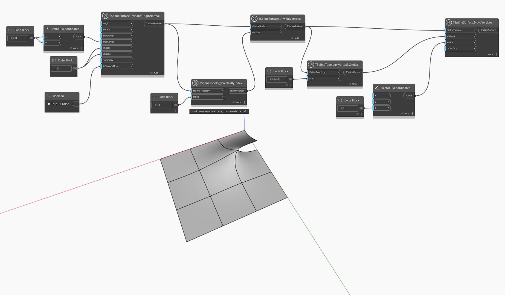

<!--- Autodesk.DesignScript.Geometry.TSpline.TSplineSurface.UnweldVertices --->
<!--- D6ESVRBW5SSM4F7J65W7OKR5DTKJAFW5F5AP23FRRR3MGXKIFVOQ --->
## In-Depth
De forma similar a `TSplineSurface.UnweldEdges`, este nodo realiza la operación de anulación de soldadura en un conjunto de vértices. Como resultado, se anula la soldadura de todas las aristas que se unen en el vértice seleccionado. A diferencia de la operación de anulación de pliegue, que crea una transición brusca alrededor del vértice manteniendo la conexión, esta acción crea una discontinuidad.

En el ejemplo siguiente, se anula la soldadura de uno de los vértices seleccionados de un plano de T-Spline con el nodo `TSplineSurface.UnweldVertices`. Se introduce una discontinuidad a lo largo de los vértices que rodean el vértice elegido, lo que se muestra tirando de un vértice hacia arriba con el nodo `TSplineSurface.MoveVertices`.

## Archivo de ejemplo

