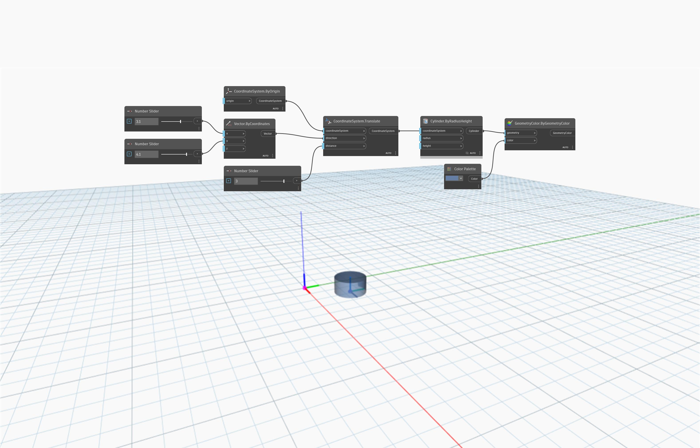

<!--- Autodesk.DesignScript.Geometry.CoordinateSystem.Translate(coordinateSystem, direction, distance) --->
<!--- D7TPJG7RLZUUPHJENWETOGTAX7U3ZWFXG4BAAHEGVXCRSUW3IVCQ --->
## En detalle:
`CoordinateSystem.Translate (coordinateSystem, direction, distance)` devuelve un nuevo CoordinateSystem trasladado por un vector de entrada y una distancia.

En el ejemplo siguiente, un CoordinateSystem en el origen se traslada en una dirección por el vector de entrada de (3.1, 4.1, 0) y una distancia de 3. La entrada `distance` anula la longitud de la entrada `vector`. El nuevo CoordinateSystem se identifica con un cilindro creado sobre él.

___
## Archivo de ejemplo

