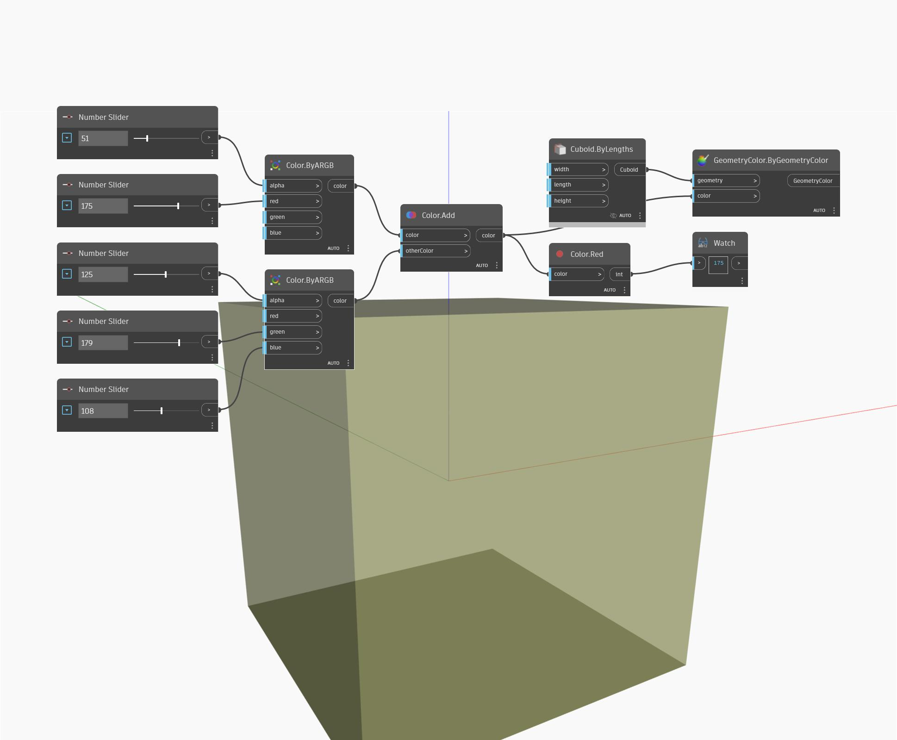

## En detalle:
Red devolverá el valor rojo de un color de entrada en el rango de 0 a 255. En el siguiente ejemplo, se crean dos colores mediante nodos ByARGB y, a continuación, se añaden los dos colores juntos. El valor rojo del color resultante se obtiene mediante un nodo Red.
___
## Archivo de ejemplo

