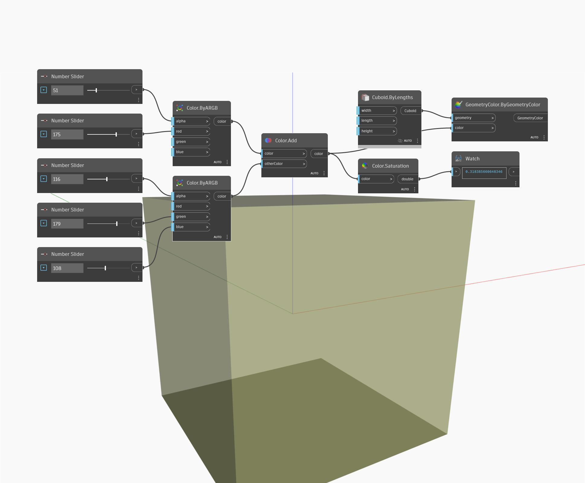

## En detalle:
Saturation devolverá el valor de saturación de un color de entrada en el rango de 0 a 1. En el siguiente ejemplo, se crean dos colores mediante nodos ByARGB y, a continuación, se añaden los dos colores juntos. El valor de saturación del color resultante se obtiene mediante un nodo Saturation.
___
## Archivo de ejemplo

