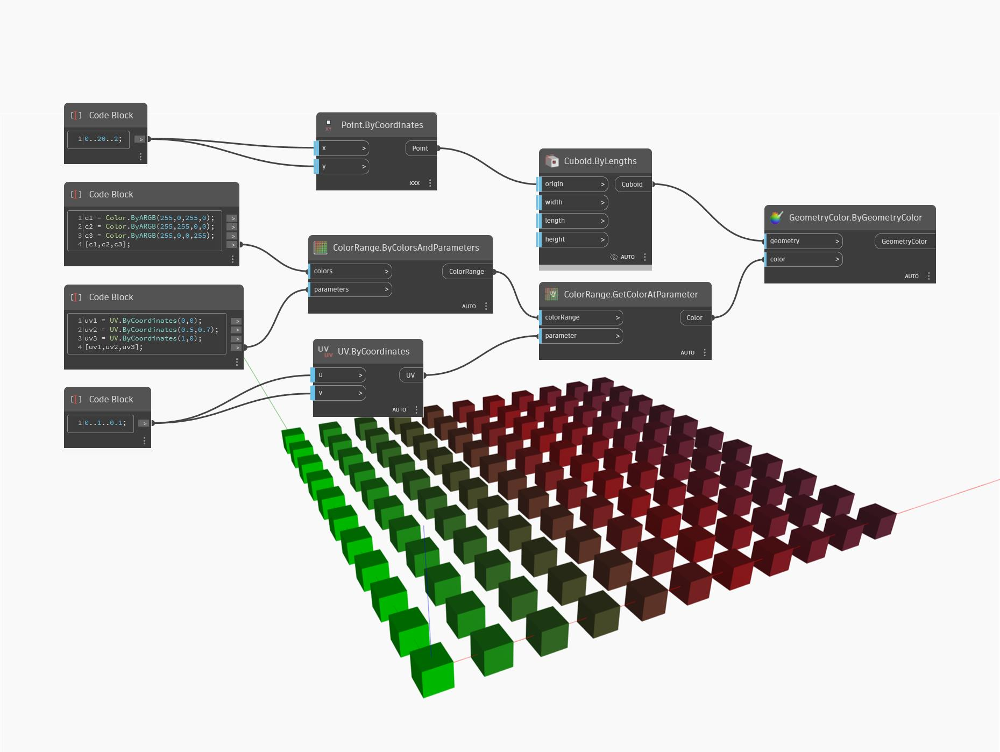

## En detalle:
ByColorsAndParameters crea un rango de colores 2D a partir de una lista de colores de entrada y una lista correspondiente de parámetros UV especificados en el rango de 0 a 1. En el siguiente ejemplo, se utiliza un bloque de código para crear tres colores diferentes (en este caso, simplemente verde, rojo y azul) y combinarlos en una lista. Se utiliza un bloque de código independiente para crear tres parámetros UV, uno para cada color. Estas dos listas se utilizan como entradas para un nodo ByColorsAndParameters. Se usa un nodo GetColorAtParameter posterior, junto con un nodo Display.ByGeometryColor, para visualizar el rango de colores 2D en un conjunto de cubos.
___
## Archivo de ejemplo

