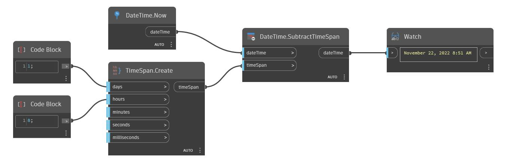

## En detalle:
SubtractTimeSpan devolverá un nuevo dateTime sustrayendo un timeSpan de un dateTime. En el siguiente ejemplo, un timeSpan de 1 día y 8 horas se resta de un dateTime de Now, lo que devuelve el 13 de noviembre de 2016 a las 4:40 a.m.
___
## Archivo de ejemplo

