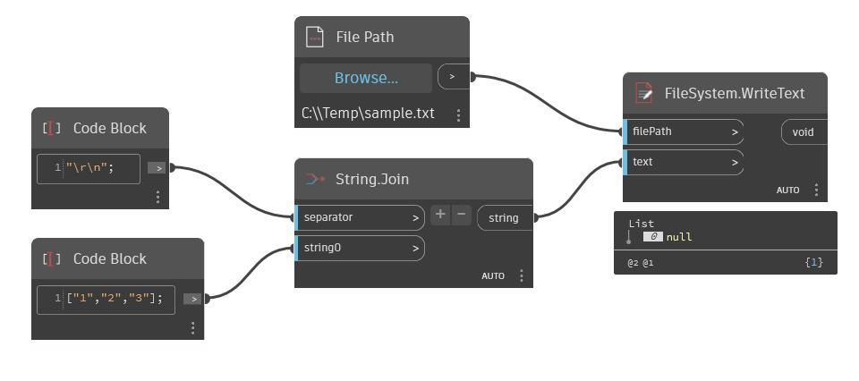

## En detalle:
WriteText escribirá una cadena en un archivo especificado. Si el archivo no existe, este nodo lo creará. Para crear nuevas líneas en el archivo de salida, se puede utilizar el carácter de escape "\r\n". En el siguiente ejemplo, hay una lista de cadenas que se desea escribir como tres líneas independientes en un archivo de texto. Se une la lista en una única cadena mediante "\r\n" como separador. A continuación, se utiliza un nodo WriteText para escribir esto en un archivo de texto.
___
## Archivo de ejemplo

