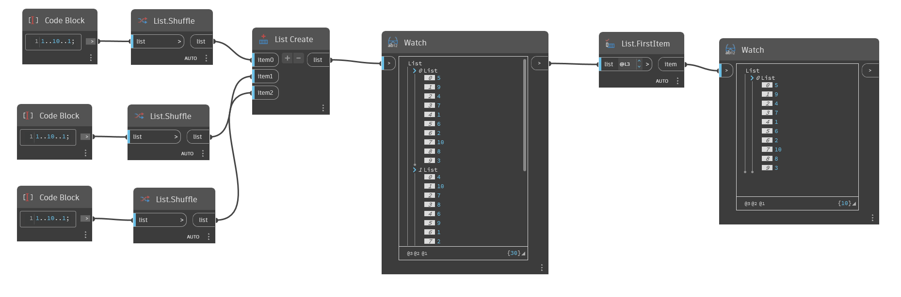

## En detalle:
`List.FirstItem` devuelve el primer elemento de una lista de entrada.

En el ejemplo siguiente, se genera una lista con tres sublistas de 10 números aleatorios entre 1 y 10. A continuación, se utiliza un nodo "List.FirstItem" para devolver el primer elemento de la lista.

Utilice el selector de nivel de lista del nodo `List.FirstItem` para experimentar con diferentes formas de devolver el primer elemento de una lista anidada. Si se establece en L1, se devuelven todos los elementos de todas las sublistas como una única lista plana. Si se establece en L2, se devuelve el primer elemento de cada sublista. Si se establece en L3, se devuelven todos los elementos de la lista 0.
___
## Archivo de ejemplo

