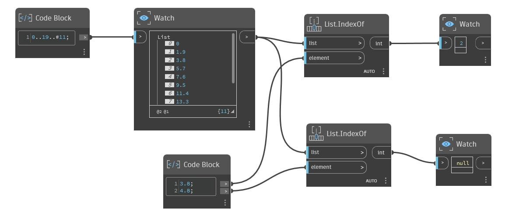

## En detalle:
`List.IndexOf` devuelve la ubicación de índice del elemento indicado en una lista. Si el elemento especificado no se encuentra en la lista o su tipo de datos no coincide con el elemento de lista (por ejemplo, la entrada es un valor doble y el elemento de lista es una cadena), `List.IndexOf` devuelve un valor "null".

Tenga en cuenta que este nodo solo devuelve el primer índice, incluso aunque el elemento aparezca varias veces en la lista. Para devolver varios índices, utilice `List.AllIndicesOf` en su lugar.
___
## Archivo de ejemplo

